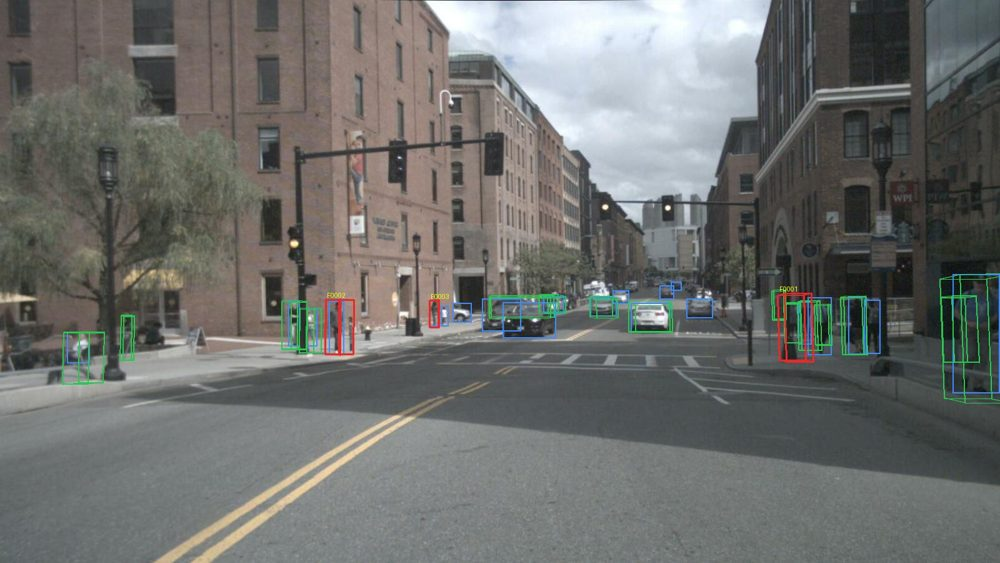

# Hướng dẫn cho thành viên nhóm

Đọc file này trước. Không cần biết code vẫn hiểu được tool làm gì và phần việc của mình.

## 1. Tool này làm gì?

Khi label 3D, mỗi vật thể (xe, người…) được bao bằng một **cuboid** (hộp 3D) trong point cloud LiDAR. Reviewer
muốn biết cuboid có đúng không thì phải mở từng camera ra so bằng mắt – chậm và dễ sót.

Tool làm việc đó tự động:

1. **Chiếu** từng cuboid 3D lên ảnh của 6 camera (giống chiếu bóng một chiếc hộp lên tường).
2. Cho **YOLO** (một model AI) tự tìm xe, người… trên ảnh.
3. **So hai bên**: cuboid có trùng vật thể YOLO thấy không? Có đúng loại không? Đúng kích thước không?
   Có vật thể nào trên ảnh mà chưa có cuboid không?
4. Xuất **báo cáo** (trang web) liệt kê các chỗ nghi sai, kèm ảnh, để reviewer chỉ cần xem những chỗ đó.

## 2. Đã làm được gì

| Phần | Trạng thái |
|---|---|
| Chiếu cuboid lên 6 camera | ✅ Xong, sai lệch ~1 pixel so với chuẩn nuScenes |
| YOLO + so khớp + 5 loại cảnh báo | ✅ Xong |
| Cài lỗi giả có đáp án để đo tool | ✅ Xong |
| Chỉnh ngưỡng để bớt báo nhầm | ✅ Xong – báo nhầm giảm từ 11 xuống 2,5 cảnh báo/frame |
| Báo cáo HTML + file CSV để chấm | ✅ Xong |
| Chạy trên Windows, không cần GPU | ✅ Xong (`setup_windows.bat` + `run_demo.bat`) |
| Chế độ "chỉ kiểm tra" nhãn thật (`scripts/check.py`) | ✅ Xong – đang kiểm được nhãn gốc nuScenes |
| Tích hợp vào CVAT | ✅ Chạy được – tạo task 3D từ nuScenes, kiểm nhãn trong task, ghi cờ `qc` lên từng cuboid (README, mục *Dùng với CVAT 3D*) |
| Đo baseline review tay / pilot | ⏳ **Cần cả nhóm** (mục 4) |

**Kết quả hiện tại** (81 frame chưa dùng khi chỉnh): tool bắt được **63%** lỗi cài vào, tốt nhất với sai class
(97%) và sai kích thước (90%); kém với xoay hướng (30%). Kém ở cảnh đêm, vật bị che, người đứng sát nhau.

**Trên CVAT:** tool đọc cuboid trong task 3D, kiểm tra rồi gắn cờ `qc` lên từng cuboid nghi sai. Thử trên task có
41 lỗi cài: bắt được 25 (61%).

**Kiểm tra bằng một nút:** bật `m44_server.bat`, kéo nút **M44 Check** lên thanh dấu trang (một lần). Mở task/job
trên CVAT → bấm **M44 Check** → danh sách lỗi tự mở ra. Chi tiết: README, mục *Nút "M44 Check"*.

**Reviewer làm thế nào:** mở báo cáo HTML của task, bấm **"Mở trong CVAT"** ở từng dòng → CVAT mở đúng frame và
chỉ hiện đúng cuboid bị cảnh báo → sửa → Save → quay lại báo cáo dòng tiếp theo. (Cách khác: trong CVAT bấm
Filters → Add rule → Score `<` 1 → Submit để hiện mọi cuboid bị gắn cờ.)

## 3. Thử trên máy bạn

**Chỉ muốn xem kết quả (không cài gì):** tải thư mục `demo_live` tech lead gửi trên Drive, mở `index.html`.

**Muốn tự chạy:** làm theo mục *Bắt đầu nhanh* trong [README](../README.md) – cài Python, bấm đúp
`setup_windows.bat`, tải nuScenes-mini vào `data\nuscenes`, bấm đúp `run_demo.bat`. Không cần card đồ hoạ.

**Đọc báo cáo:**

| Màu | Ý nghĩa |
|---|---|
| Xanh lá | Cuboid khớp vật thể trên ảnh |
| Đỏ | Cuboid bị cảnh báo |
| Xanh dương | Vật thể YOLO nhìn thấy |
| Cam | Vật thể thấy trên ảnh nhưng chưa có cuboid |

## 4. Việc của bạn

### Người chấm tool
1. Mở `out\mini_val\index.html` (tech lead gửi) và file `flags_for_grading.csv`.
2. Tải CSV lên Google Sheet của nhóm.
3. Với từng dòng: xem ảnh (cột `anh`), điền cột **Dung_hay_Nham** là `Đúng` (tool chỉ đúng chỗ có vấn đề) hoặc
   `Nhầm` (cuboid thực ra ổn). Cột **Ghi_chu**: nếu nhầm thì vì sao – *bị che, trời tối, YOLO không thấy, vật lạ…*
4. Bạn **không** được xem `injected_errors.json` (đáp án) – chấm mù thì số liệu mới khách quan.

Kết quả của bạn = **độ chính xác của tool khi người thật kiểm**, số liệu chính của báo cáo cuối.

### Dữ liệu & đáp án
- Chọn ~20 frame trong tập val để đo baseline (nhiều loại cảnh: ngày/đêm, đông/vắng).
- Đề xuất loại lỗi annotator hay mắc thật (từ backlog của nhóm) để bổ sung vào bộ lỗi cài.

### PM & tài liệu
- Mở issue trên GitHub cho mỗi vướng mắc; báo cáo thứ 5 / Chủ nhật trước 12:00.
- Giữ `docs/decision-log.md` cập nhật khi nhóm chốt quyết định mới.
- Chuẩn bị slide + video demo theo [docs/demo.md](demo.md).

### Cả nhóm – đo baseline (tuần 4) và pilot (tuần 6)
1. Mỗi người review ~20 frame **bằng tay** (không dùng tool), bấm giờ.
2. Ghi vào sheet theo mẫu `templates/baseline_review.csv`: frame, người review, thời gian, số lỗi tìm được.
3. Tuần 6 làm lại **có tool** → so sánh thời gian và số lỗi tìm được. Đây là con số "tool giúp nhanh hơn bao nhiêu".

## 5. Thuật ngữ

| Từ | Nghĩa |
|---|---|
| Cuboid | Hộp 3D bao vật thể trong point cloud |
| Chiếu (projection) | Tính xem hộp 3D rơi vào đâu trên ảnh camera |
| YOLO | Model AI tìm vật thể trên ảnh 2D |
| IoU | Mức trùng nhau của hai khung (0 = không chạm, 1 = trùng hoàn toàn) |
| Recall | Trong các lỗi có thật, tool bắt được bao nhiêu phần trăm |
| Báo động giả | Tool cảnh báo nhưng nhãn thực ra đúng |
| Train / val | Phần dữ liệu dùng để chỉnh ngưỡng / phần để kiểm tra khách quan |

## 6. Lỗi thường gặp

| Lỗi | Cách xử lý |
|---|---|
| `setup_windows.bat` báo chưa có Python | Cài Python 3.11, nhớ tick *Add python.exe to PATH*, mở lại máy |
| `run_demo.bat` báo không thấy nuScenes-mini | Kiểm tra `data\nuscenes\v1.0-mini` có tồn tại; giải nén đúng chỗ |
| Chạy lâu | Lần đầu phải tải model YOLO (~40 MB) và chạy trên CPU – ~2 phút cho 10 frame là bình thường |
| Lỗi khác | Chụp màn hình cửa sổ đen, gửi vào kênh Discord của nhóm |
